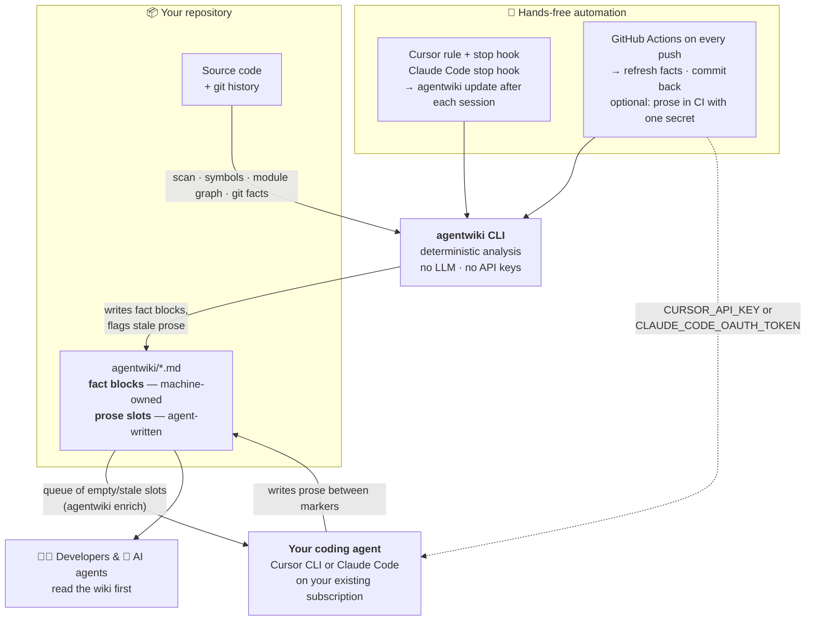

# AgentWiki

**A self-maintaining wiki for your codebase.**

Watch on Youtube 👉 [VIDEO](https://youtu.be/jHi7zhT1AJE?si=iDdLV7NpKsZHppyO)


```sh
npx @julianoczkowski/agentwiki init
```

One command, two Enter presses, complete wiki. No API keys, no configuration, no new subscription — built for prototyping repos where the "team" is a designer or PM, not a DevOps engineer.

## What is it?

AgentWiki generates and maintains a documentation wiki (`agentwiki/` in your repo) out of two kinds of content:

- **Fact blocks** — machine-owned. Generated deterministically from your code: files, exported symbols, import graphs (with a Mermaid diagram), manifests, and git history. Regenerated on every run, they can never hallucinate and never go stale silently.
- **Prose sections** — narrative explanations ("what is this module for", "what are we working on"). AgentWiki doesn't write these itself and never calls an LLM. Instead it hands them to **the coding agent you already pay for** — Cursor CLI or Claude Code, on your existing subscription.

## How it works



The loop: the CLI keeps the *facts* true on every change (locally via editor hooks, remotely via GitHub Actions), and whenever facts change under a prose section, that section is flagged stale and queued for your agent to rewrite — so the narrative can drift for at most one enrich cycle, and nothing is ever hallucinated into the fact tables.

## The one-command experience

`init` walks you through everything interactively:

1. **Monorepo? Pick your app** — when the repo contains multiple apps/packages (npm/pnpm workspaces, NX — including custom `workspaceLayout` dirs like `clients/apps` and `project.json`-only apps, `apps/*`-style layouts, nested Go/Rust/Python manifests), an arrow-key select asks which app the wiki should document — one app in depth, or the whole repository. Only *applications* are listed; shared packages/libraries sit behind a "Something else…" option so the list stays clean. The choice is saved, and every later `update` (hooks, CI) honors it silently. Single-project repos never see this question. Change it any time with `agentwiki init --scope <dir>` (`--scope .` = whole repo).
2. **Pick your prose writer** — arrow-key select between Cursor CLI and Claude Code, with live readiness shown for each (installed? signed in?). If a tool is missing or logged out, you get numbered *type-this-in-your-terminal* steps, written for non-developers.
3. **Watch the wiki generate** — scan, git mining, symbol extraction, module graph, page generation, integration wiring, each with live progress.
4. **"Write the Prose Now?"** — if your agent is ready, press Enter and it writes every section in the same run, with a live spinner and elapsed time. A few minutes later: *"all N slots written — wiki is fully fresh."*

Most users never need a second command. Everything below is automation or power-user territory.

https://github.com/user-attachments/assets/fe1411e3-8772-4080-834f-f3cc83f4be2f


## What init creates

| Output | Purpose |
| --- | --- |
| `agentwiki/quickstart.md` | Identity facts, run scripts, module map |
| `agentwiki/architecture.md` | Layout, entrypoints, Mermaid module-dependency graph |
| `agentwiki/activity.md` | Hot files, recent commits, contributors (90-day window) |
| `agentwiki/modules/*.md` | Per-module pages: files, exports, imports/imported-by, activity |
| `.cursor/rules/agentwiki.mdc` | Always-on rule: Cursor's agent reads the wiki first and fills any pending prose as a side effect of normal work |
| `.cursor/hooks.json` | `stop` hook: refresh facts after each Cursor agent session (runs via npx — no global install needed; your other hooks are preserved) |
| `AGENTS.md` + `CLAUDE.md` | Pointer sections for coding agents — both files always ensured, existing content never overwritten |
| `.github/workflows/agentwiki.yml` | CI automation (see below) |

## Monorepos

Point the wiki at one app instead of the whole repo. On a fresh `init` in a monorepo, AgentWiki detects your applications and asks which one to document:

```
┌ Which App Should the Wiki Document?
│
│ This looks like a monorepo with 2 apps. AgentWiki can document
│ one of them in depth, or the whole repository at once.
│
● The whole repository (one wiki covering everything at once)
○ apps/admin/ (@repo/admin)
○ apps/web/ (@repo/web)
○ Something else… (show 2 shared packages/libraries too)
```

- **Detected layouts:** npm/pnpm workspaces, NX (custom `workspaceLayout` dirs like `clients/apps`, `project.json`-only apps), plain `apps/*` conventions, and nested Go/Rust/Python manifests up to three levels deep.
- **Apps only, by default:** shared packages and libraries stay behind "Something else…" so the choice is obvious.
- **Everything is scoped:** file scan, module graph, symbols, hot files, and recent commits cover only the chosen app; commits to other apps never touch your wiki's prose.
- **Set it directly:** `agentwiki init --scope apps/web` (CI-friendly), `--scope .` to go back to whole-repo. The choice is saved in `agentwiki/.agentwiki.json` — hooks and CI honor it with zero prompts.
- **Run it from anywhere:** every command anchors at the **git repo root**, no matter which subfolder you're standing in — the wiki, rules, hooks, and the GitHub workflow always land in one canonical place, exactly as in a single-project repo. Bonus: run `init` from inside an app's folder and that app comes pre-selected in the picker.

## How it stays current — the full lifecycle, hands-free

Verified end-to-end on a real repo:

| You do | The automation does |
| --- | --- |
| Routine commit & push | CI refreshes volatile facts (git head, activity); **prose stays fresh** |
| Change a module's exports | Its facts table updates; its prose is flagged **stale** (never overwritten) and rewritten on the next enrich |
| Add a whole new module | CI **creates its wiki page** with fact tables and queued prose slots; it appears in the map and the dependency graph |
| Delete a module | CI **deletes the orphaned page**, cleans the map/graph, and flags any prose that still mentions it |
| Work in Cursor | The stop-hook refreshes facts; the rule has Cursor's agent fill pending prose as it goes |

The key mechanic: prose freshness is a hash of the page's **structural** facts only. Volatile facts (commit hashes, hot files) are excluded, so ordinary commits don't churn your documentation — only real shape changes do. Only `activity.md`'s *current-focus* section intentionally tracks every commit.

## CI prose enrichment — turns itself on

The workflow's fact refresh needs **zero secrets**. Prose enrichment in CI is built in and self-enabling: add ONE repository secret and the next push starts writing and committing prose automatically — no YAML editing:

| Secret | Where it comes from |
| --- | --- |
| `CURSOR_API_KEY` | cursor.com/dashboard → API Keys (same subscription) |
| `CLAUDE_CODE_OAUTH_TOKEN` | run `claude setup-token` locally (personal repos; teams should use `ANTHROPIC_API_KEY`) |

Without a secret, the enrichment steps skip themselves with a clear message. Bot commits never re-trigger the workflow, so there are no loops.

## Commands

```
agentwiki init                 The one command: generate, wire, offer prose
        --scope <dir>              monorepo: document one app (`.` = whole repo)
agentwiki update               Refresh fact blocks; flag prose whose facts changed
agentwiki status               Freshness overview per page/slot + backend readiness
agentwiki queue [--json]       List prose slots that need writing
agentwiki enrich               Have your coding agent write the queued slots now
        --backend cursor|claude    override the saved preference
        --dry-run                  print the prompt, run nothing
        --verbose                  stream the agent's raw output
agentwiki backend              Re-pick your prose writer interactively
agentwiki pause / resume       Pause automation reversibly (docs kept)
agentwiki remove [--docs] [-y] Remove integrations with confirmation; docs KEPT
                               unless --docs — the wiki stays useful as plain markdown
agentwiki setup-action         (Re)write the GitHub Actions workflow
agentwiki uninstall            Remove the CLI from this computer (projects untouched)
agentwiki doctor               Check node, git, backend install + auth state
```

The enrich report is **deterministic**: it lists exactly which files gained which sections, computed from what actually changed on disk — never from the agent's own claims. Failed runs auto-show the agent's last output lines; the CLI also recognizes environment noise (like zsh's "insecure directories" warning) and explains the one-time fix.

## How pages stay honest

```markdown
<!-- agentwiki:facts id="dependencies" hash="1992f504c371" -->
- **Imports from:** `src (root)` (4)      ← regenerated every run, never edited
<!-- /agentwiki:facts -->

<!-- agentwiki:facts id="git-state" hash="1992f504c371" volatile="true" -->
- **Git:** branch `main` at `abc1234`     ← refreshed, but never stales prose
<!-- /agentwiki:facts -->

<!-- agentwiki:prose slot="purpose" status="fresh" facts-hash="1992f504c371" -->
This module owns the agent session lifecycle…   ← written by YOUR agent
<!-- /agentwiki:prose -->
```

A prose slot is **fresh** while its recorded `facts-hash` matches the page's current structural facts. A content snapshot guarantees no-op runs leave metadata untouched — safe for hooks and scheduled CI. Markers are invisible when the markdown renders, so the wiki reads clean everywhere — even after `remove`.

## Leaving is easy

`pause` detaches the automation reversibly. `remove` strips every integration surgically (foreign hooks and your other AGENTS.md/CLAUDE.md content survive) and **keeps your docs** unless you pass `--docs`. `uninstall` removes the command itself, in plain language a non-developer can follow, and never touches your projects. Nothing global is ever stored on your machine.

## Development

```sh
git clone https://github.com/julianoczkowski/agentwiki
cd agentwiki
npm install
npm run dev -- doctor     # run from source (tsx)
npm test                  # vitest unit suite
npm run build             # tsc -> dist/, then npm link for a global command
```

Releases are automated via [npm Trusted Publishers (OIDC)](docs/npm-deployment.md): `npm version patch && git push --follow-tags` — no tokens anywhere. See [CHANGELOG.md](CHANGELOG.md) for release notes.

---
## Author


Built by **Julian Oczkowski** — I build AI tools for knowledge work.

- 🎥 **[YouTube · @aiforwork_app](https://www.youtube.com/@aiforwork_app)** — walkthroughs and AI-for-work tutorials
- ✍️ **[Medium](https://medium.com/@julian.oczkowski)** — deep dives on product and AI workflows
- 💼 **[LinkedIn](https://www.linkedin.com/in/julianoczkowski/)** — connect and follow along

MIT © Julian Oczkowski · 📺 [youtube.com/@aiforwork_app](https://www.youtube.com/@aiforwork_app)
